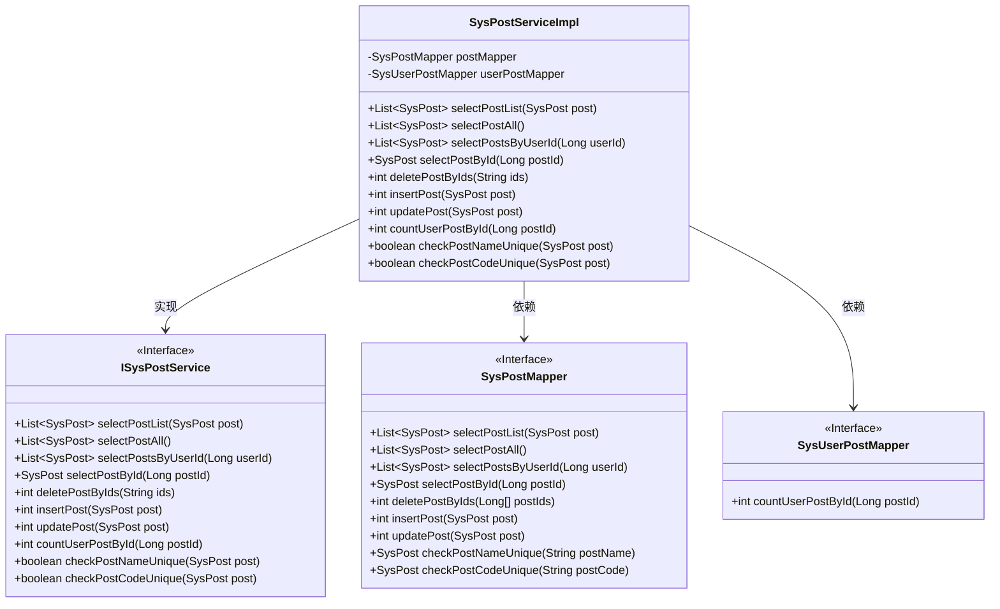
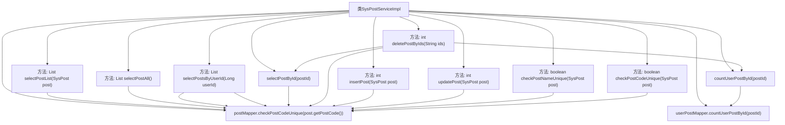

# 基础信息

|      |      |
|------|------|
| 名称 | SysPostServiceImpl |
| 编码语言 | .java |
| 代码路径 | RuoYi-main/ruoyi-system/src/main/java/com/ruoyi/system/service/impl/SysPostServiceImpl.java |
| 包名 | com.ruoyi.system.service.impl |
| 依赖项 | ['java.util.List', 'org.springframework.beans.factory.annotation.Autowired', 'org.springframework.stereotype.Service', 'com.ruoyi.common.constant.UserConstants', 'com.ruoyi.common.core.text.Convert', 'com.ruoyi.common.exception.ServiceException', 'com.ruoyi.common.utils.StringUtils', 'com.ruoyi.system.domain.SysPost', 'com.ruoyi.system.mapper.SysPostMapper', 'com.ruoyi.system.mapper.SysUserPostMapper', 'com.ruoyi.system.service.ISysPostService'] |
| 概述说明 | SysPostServiceImpl类实现岗位操作，依赖SysPostMapper和SysUserPostMapper。 |

# 说明

SysPostServiceImpl类负责岗位的查询、新增、删除、修改以及校验等核心操作。该类依赖于SysPostMapper和SysUserPostMapper两个接口，通过这两个接口实现对岗位数据的访问和操作。SysPostMapper主要用于岗位的基本数据管理，而SysUserPostMapper则处理用户与岗位之间的关联关系。整体设计确保了岗位管理的功能完整性和数据一致性。

# 类列表 Class Summary

| 名称   | 类型  | 说明 |
|-------|------|-------------|
| SysPostServiceImpl | class | SysPostServiceImpl类实现岗位查询、增删改、校验等操作，依赖SysPostMapper和SysUserPostMapper。 |

## 类 SysPostServiceImpl

|      |      |
|------|------|
| 访问范围 | @Service;public |
| 类型 | class |
| 名称 | SysPostServiceImpl |
| 说明 | SysPostServiceImpl类实现岗位查询、增删改、校验等操作，依赖SysPostMapper和SysUserPostMapper。 |

### UML类图

### 描述：
`SysPostServiceImpl` 类实现了 `ISysPostService` 接口，负责处理与岗位相关的业务逻辑。它依赖于 `SysPostMapper` 和 `SysUserPostMapper` 接口来访问数据库，执行如查询、插入、更新、删除等操作。类中提供了多种方法，包括查询岗位列表、根据用户ID查询岗位、删除岗位、校验岗位名称和编码的唯一性等。通过这些方法，`SysPostServiceImpl` 类能够有效地管理与岗位相关的数据操作。

### 内部方法调用关系图

这段代码描述了一个名为`SysPostServiceImpl`的服务类，该类实现了`ISysPostService`接口，主要用于管理岗位信息。类中包含了多个方法，分别用于查询、插入、更新、删除岗位信息，以及校验岗位名称和编码的唯一性。代码通过`postMapper`和`userPostMapper`两个映射器与数据库进行交互，确保数据的准确性和一致性。流程图展示了类中各个方法的调用关系，清晰地反映了数据处理的流程。

### 字段列表 Field List

| 名称  | 类型  | 说明 |
|-------|-------|------|
| postMapper | SysPostMapper | 自动注入SysPostMapper实例到postMapper变量。 |
| userPostMapper | SysUserPostMapper | 自动注入SysUserPostMapper实例。 |

### 方法列表 Method List

| 名称  | 类型  | 说明 |
|-------|-------|------|
| countUserPostById | int | 重写方法，通过用户帖子ID统计帖子数量。 |
| deletePostByIds | int | 通过ID删除帖子，若已分配则抛出异常。 |
| selectPostById | SysPost | 重写方法通过ID查询岗位信息。 |
| updatePost | int | 重写updatePost方法，调用postMapper更新帖子数据。 |
| selectPostList | List<SysPost> | 重写方法，调用postMapper查询岗位列表并返回结果。 |
| insertPost | int | 重写insertPost方法，调用postMapper的insertPost方法插入数据。 |
| selectPostsByUserId | List<SysPost> | 该方法通过用户ID查询用户岗位，并标记所有岗位中用户拥有的岗位。 |
| checkPostNameUnique | boolean | 检查岗位名称是否唯一，忽略当前岗位ID。 |
| selectPostAll | List<SysPost> | 重写方法`selectPostAll`，调用`postMapper.selectPostAll()`返回所有岗位列表。 |
| checkPostCodeUnique | boolean | 检查岗位编码唯一性，存在相同编码且ID不同则返回不唯一。 |

