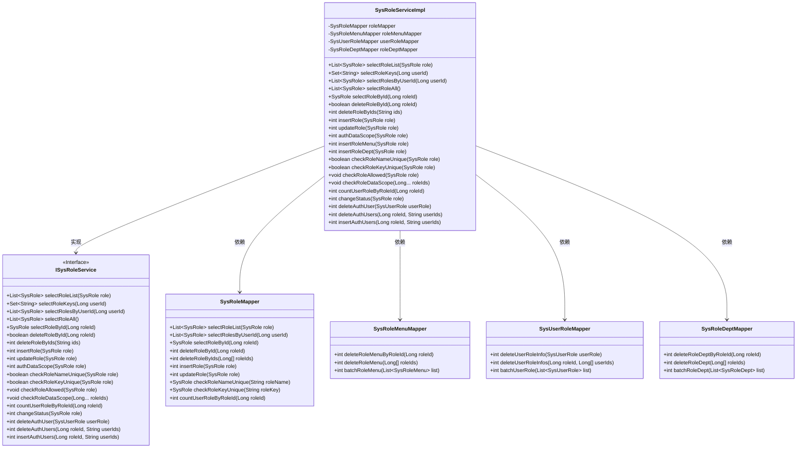

# 基础信息

|      |      |
|------|------|
| 名称 | SysRoleServiceImpl |
| 编码语言 | .java |
| 代码路径 | RuoYi-main/ruoyi-system/src/main/java/com/ruoyi/system/service/impl/SysRoleServiceImpl.java |
| 包名 | com.ruoyi.system.service.impl |
| 依赖项 | ['java.util.ArrayList', 'java.util.Arrays', 'java.util.HashSet', 'java.util.List', 'java.util.Set', 'org.springframework.beans.factory.annotation.Autowired', 'org.springframework.stereotype.Service', 'org.springframework.transaction.annotation.Transactional', 'com.ruoyi.common.annotation.DataScope', 'com.ruoyi.common.constant.UserConstants', 'com.ruoyi.common.core.domain.entity.SysRole', 'com.ruoyi.common.core.domain.entity.SysUser', 'com.ruoyi.common.core.text.Convert', 'com.ruoyi.common.exception.ServiceException', 'com.ruoyi.common.utils.ShiroUtils', 'com.ruoyi.common.utils.StringUtils', 'com.ruoyi.common.utils.spring.SpringUtils', 'com.ruoyi.system.domain.SysRoleDept', 'com.ruoyi.system.domain.SysRoleMenu', 'com.ruoyi.system.domain.SysUserRole', 'com.ruoyi.system.mapper.SysRoleDeptMapper', 'com.ruoyi.system.mapper.SysRoleMapper', 'com.ruoyi.system.mapper.SysRoleMenuMapper', 'com.ruoyi.system.mapper.SysUserRoleMapper', 'com.ruoyi.system.service.ISysRoleService'] |
| 概述说明 | SysRoleServiceImpl管理角色，支持增删改查、权限校验及用户授权。 |

# 说明

SysRoleServiceImpl是一个实现角色管理功能的类，提供了全面的角色操作服务。其主要功能包括角色的查询、新增、修改和删除，确保角色的基本管理需求得到满足。此外，该类还负责角色权限的校验，确保用户在系统中的操作符合其角色权限。同时，SysRoleServiceImpl还处理用户授权操作，为用户分配和调整角色权限，保障系统的安全性和权限管理的有效性。通过这些功能，SysRoleServiceImpl实现了对角色和权限的全面管理，为系统提供了稳定可靠的角色管理支持。

# 类列表 Class Summary

| 名称   | 类型  | 说明 |
|-------|------|-------------|
| SysRoleServiceImpl | class | SysRoleServiceImpl实现角色管理，包括查询、新增、修改、删除角色，以及角色权限校验和用户授权操作。 |

## 类 SysRoleServiceImpl

|      |      |
|------|------|
| 访问范围 | @Service;public |
| 类型 | class |
| 名称 | SysRoleServiceImpl |
| 说明 | SysRoleServiceImpl实现角色管理，包括查询、新增、修改、删除角色，以及角色权限校验和用户授权操作。 |

### UML类图

### 描述
`SysRoleServiceImpl`类实现了`ISysRoleService`接口，主要负责系统角色管理的业务逻辑。它依赖于`SysRoleMapper`、`SysRoleMenuMapper`、`SysUserRoleMapper`和`SysRoleDeptMapper`四个Mapper类，分别用于角色、角色菜单、用户角色和角色部门的数据操作。该类提供了角色的增删改查、权限校验、数据权限管理等功能，并通过事务管理确保数据一致性。

### 内部方法调用关系图

```mermaid
graph TD
    A["类SysRoleServiceImpl"]
    B["属性: SysRoleMapper roleMapper"]
    C["属性: SysRoleMenuMapper roleMenuMapper"]
    D["属性: SysUserRoleMapper userRoleMapper"]
    E["属性: SysRoleDeptMapper roleDeptMapper"]
    F["方法: List<SysRole> selectRoleList(SysRole role)"]
    G["方法: Set<String> selectRoleKeys(Long userId)"]
    H["方法: List<SysRole> selectRolesByUserId(Long userId)"]
    I["方法: List<SysRole> selectRoleAll()"]
    J["方法: SysRole selectRoleById(Long roleId)"]
    K["方法: boolean deleteRoleById(Long roleId)"]
    L["方法: int deleteRoleByIds(String ids)"]
    M["方法: int insertRole(SysRole role)"]
    N["方法: int updateRole(SysRole role)"]
    O["方法: int authDataScope(SysRole role)"]
    P["方法: int insertRoleMenu(SysRole role)"]
    Q["方法: int insertRoleDept(SysRole role)"]
    R["方法: boolean checkRoleNameUnique(SysRole role)"]
    S["方法: boolean checkRoleKeyUnique(SysRole role)"]
    T["方法: void checkRoleAllowed(SysRole role)"]
    U["方法: void checkRoleDataScope(Long... roleIds)"]
    V["方法: int countUserRoleByRoleId(Long roleId)"]
    W["方法: int changeStatus(SysRole role)"]
    X["方法: int deleteAuthUser(SysUserRole userRole)"]
    Y["方法: int deleteAuthUsers(Long roleId, String userIds)"]
    Z["方法: int insertAuthUsers(Long roleId, String userIds)"]

    A --> B
    A --> C
    A --> D
    A --> E
    A --> F
    A --> G
    A --> H
    A --> I
    A --> J
    A --> K
    A --> L
    A --> M
    A --> N
    A --> O
    A --> P
    A --> Q
    A --> R
    A --> S
    A --> T
    A --> U
    A --> V
    A --> W
    A --> X
    A --> Y
    A --> Z
```

**流程图描述：**  
该流程图展示了`SysRoleServiceImpl`类的结构及其方法调用关系。`SysRoleServiceImpl`类实现了`ISysRoleService`接口，包含了多个用于角色管理的核心方法，如角色查询、新增、修改、删除、权限校验等。每个方法通过调用相应的Mapper接口与数据库进行交互，实现了角色信息的增删改查操作。

### 字段列表 Field List

| 名称  | 类型  | 说明 |
|-------|-------|------|
| roleMapper | SysRoleMapper | 自动注入SysRoleMapper角色映射器。 |
| roleMenuMapper | SysRoleMenuMapper | 自动注入SysRoleMenuMapper实例。 |
| roleDeptMapper | SysRoleDeptMapper | 自动注入SysRoleDeptMapper实例。 |
| userRoleMapper | SysUserRoleMapper | 自动注入SysUserRoleMapper实例。 |

### 方法列表 Method List

| 名称  | 类型  | 说明 |
|-------|-------|------|
| checkRoleAllowed | void | 检查角色权限，禁止操作超级管理员角色。 |
| selectRoleAll | List<SysRole> | 重写方法返回所有系统角色列表。 |
| countUserRoleByRoleId | int | 根据角色ID统计用户角色数量的方法。 |
| selectRoleKeys | Set<String> | 根据用户ID查询角色键并返回去重集合。 |
| deleteAuthUser | int | 重写方法，删除用户角色信息。 |
| selectRoleById | SysRole | 重写方法，通过角色ID查询并返回系统角色信息。 |
| selectRoleList | List<SysRole> | 重写方法，带数据权限，返回角色列表。 |
| authDataScope | int | 更新角色信息，删除角色部门关联，新增角色部门权限。 |
| updateRole | int | 更新角色信息并调整其菜单关联。 |
| insertAuthUsers | int | 方法插入用户与角色关联，返回批量操作结果。 |
| checkRoleDataScope | void | 非管理员检查角色数据权限，无权限则抛出异常。 |
| deleteRoleById | boolean | 通过事务删除角色及其关联的菜单和部门。 |
| insertRoleMenu | int | 插入角色菜单，批量处理角色与菜单关系。 |
| deleteAuthUsers | int | 删除指定角色下用户权限的Java方法。 |
| insertRoleDept | int | 插入角色与部门管理，批量处理并返回影响行数。 |
| changeStatus | int | 重写changeStatus方法，调用roleMapper更新角色状态。 |
| checkRoleKeyUnique | boolean | 检查角色键是否唯一，若存在且ID不同则返回不唯一，否则返回唯一。 |
| insertRole | int | 方法insertRole新增角色信息并返回插入角色菜单结果。 |
| deleteRoleByIds | int | 删除角色前检查权限和数据范围，若已分配用户则报错，最后删除角色及相关关联。 |
| checkRoleNameUnique | boolean | 检查角色名是否唯一，排除自身ID后返回结果。 |
| selectRolesByUserId | List<SysRole> | 根据用户ID查询并标记用户角色。 |

