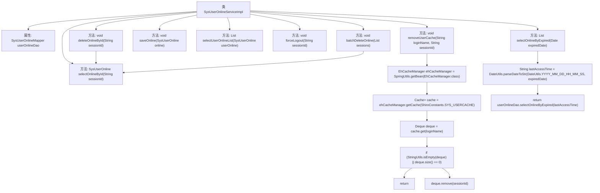

# 基础信息

|      |      |
|------|------|
| 名称 | SysUserOnlineServiceImpl |
| 编码语言 | .java |
| 代码路径 | RuoYi-main/ruoyi-system/src/main/java/com/ruoyi/system/service/impl/SysUserOnlineServiceImpl.java |
| 包名 | com.ruoyi.system.service.impl |
| 依赖项 | ['java.io.Serializable', 'java.util.Date', 'java.util.Deque', 'java.util.List', 'com.ruoyi.common.utils.spring.SpringUtils', 'org.apache.shiro.cache.Cache', 'org.apache.shiro.cache.ehcache.EhCacheManager', 'org.springframework.beans.factory.annotation.Autowired', 'org.springframework.stereotype.Service', 'com.ruoyi.common.constant.ShiroConstants', 'com.ruoyi.common.utils.DateUtils', 'com.ruoyi.common.utils.StringUtils', 'com.ruoyi.system.domain.SysUserOnline', 'com.ruoyi.system.mapper.SysUserOnlineMapper', 'com.ruoyi.system.service.ISysUserOnlineService'] |
| 概述说明 | SysUserOnlineServiceImpl实现ISysUserOnlineService，提供用户会话管理及缓存清理功能。 |

# 说明

SysUserOnlineServiceImpl实现了ISysUserOnlineService接口，主要负责在线用户会话的管理。该服务提供了查询在线用户会话的功能，允许系统获取当前在线用户的信息。同时，它还支持删除在线用户会话，确保系统能够及时清理不再活跃的用户会话。此外，服务还具备保存在线用户会话的能力，用于记录用户的活动状态。最后，SysUserOnlineServiceImpl还提供了缓存清理功能，确保在线用户数据的准确性和一致性，避免缓存过期或冗余数据影响系统性能。

# 类列表 Class Summary

| 名称   | 类型  | 说明 |
|-------|------|-------------|
| SysUserOnlineServiceImpl | class | SysUserOnlineServiceImpl实现ISysUserOnlineService，提供在线用户会话的查询、删除、保存及缓存清理功能。 |


## 类 SysUserOnlineServiceImpl

|      |      |
|------|------|
| 访问范围 | @Service;public |
| 类型 | class |
| 名称 | SysUserOnlineServiceImpl |
| 说明 | SysUserOnlineServiceImpl实现ISysUserOnlineService，提供在线用户会话的查询、删除、保存及缓存清理功能。 |


### UML类图

```mermaid
classDiagram
    class SysUserOnlineServiceImpl {
        -SysUserOnlineMapper userOnlineDao
        +SysUserOnline selectOnlineById(String sessionId)
        +void deleteOnlineById(String sessionId)
        +void batchDeleteOnline(List~String~ sessions)
        +void saveOnline(SysUserOnline online)
        +List~SysUserOnline~ selectUserOnlineList(SysUserOnline userOnline)
        +void forceLogout(String sessionId)
        +void removeUserCache(String loginName, String sessionId)
        +List~SysUserOnline~ selectOnlineByExpired(Date expiredDate)
    }

    class SysUserOnlineMapper {
        +SysUserOnline selectOnlineById(String sessionId)
        +void deleteOnlineById(String sessionId)
        +void saveOnline(SysUserOnline online)
        +List~SysUserOnline~ selectUserOnlineList(SysUserOnline userOnline)
        +List~SysUserOnline~ selectOnlineByExpired(String lastAccessTime)
    }

    class EhCacheManager {
        +Cache~String, Deque~Serializable~~ getCache(String cacheName)
    }

    class Cache~K, V~ {
        +V get(K key)
    }

    class Deque~T~ {
        +void remove(T element)
        +int size()
    }

    class StringUtils {
        +boolean isNotNull(Object obj)
        +boolean isEmpty(Collection~?~ collection)
    }

    class DateUtils {
        +String parseDateToStr(String format, Date date)
    }

    class ShiroConstants {
        <<Interface>>
        +String SYS_USERCACHE
    }

    class SpringUtils {
        +T getBean(Class~T~ clazz)
    }

    SysUserOnlineServiceImpl --> SysUserOnlineMapper : 依赖
    SysUserOnlineServiceImpl --> EhCacheManager : 依赖
    SysUserOnlineServiceImpl --> StringUtils : 依赖
    SysUserOnlineServiceImpl --> DateUtils : 依赖
    SysUserOnlineServiceImpl --> SpringUtils : 依赖
    EhCacheManager --> Cache~String, Deque~Serializable~~ : 依赖
    Cache~String, Deque~Serializable~~ --> Deque~Serializable~ : 依赖
    SpringUtils --> ShiroConstants : 依赖
```

这段代码描述了一个`SysUserOnlineServiceImpl`类，它实现了`ISysUserOnlineService`接口，并依赖于`SysUserOnlineMapper`、`EhCacheManager`、`StringUtils`、`DateUtils`和`SpringUtils`等类。该类提供了对在线用户会话信息的增删改查操作，并支持通过缓存管理用户会话信息。代码中使用了泛型、集合操作和日期处理等常见功能，展示了如何在Spring框架中实现复杂的业务逻辑。


### 内部方法调用关系图



这段代码描述了一个名为 `SysUserOnlineServiceImpl` 的服务类，它实现了 `ISysUserOnlineService` 接口。该类通过 `SysUserOnlineMapper` 与数据库进行交互，提供了多种方法来管理在线用户会话信息。包括查询、删除、保存、批量删除、强制退出用户、清理用户缓存以及根据过期日期查询会话集合等功能。流程图展示了类中各个方法的调用关系，特别是 `deleteOnlineById` 和 `batchDeleteOnline` 方法都调用了 `selectOnlineById` 方法，而 `removeUserCache` 方法则涉及缓存的获取和操作。

### 字段列表 Field List

| 名称  | 类型  | 说明 |
|-------|-------|------|
| userOnlineDao | SysUserOnlineMapper | 自动注入SysUserOnlineMapper实例到userOnlineDao变量。 |

### 方法列表 Method List

| 名称  | 类型  | 说明 |
|-------|-------|------|
| forceLogout | void | 强制登出方法，通过sessionId删除在线用户记录。 |
| selectOnlineById | SysUserOnline | 重写方法，通过sessionId查询在线用户信息。 |
| removeUserCache | void | 移除用户缓存中的指定会话ID。 |
| saveOnline | void | 重写saveOnline方法，调用userOnlineDao保存在线用户信息。 |
| selectOnlineByExpired | List<SysUserOnline> | 方法`selectOnlineByExpired`根据过期日期查询在线用户列表。 |
| batchDeleteOnline | void | 批量删除在线用户会话，逐个检查并删除有效会话。 |
| selectUserOnlineList | List<SysUserOnline> | 重写方法，查询在线用户列表并返回结果。 |
| deleteOnlineById | void | 根据sessionId删除在线用户信息，若存在则执行删除操作。 |


