# 基础信息

|      |      |
|------|------|
| 名称 | impl |
| 编码语言 | .java |
| 代码路径 | RuoYi-main/ruoyi-system/src/main/java/com/ruoyi/system/service/impl |
| 包名 | RuoYi-main.ruoyi-system.src.main.java.com.ruoyi.system.service.impl |
| 概述说明 | 系统实现日志、用户、配置、岗位、角色、登录、字典、公告、部门、在线用户、字典类型、菜单等管理功能，确保数据完整性和系统稳定性。 |

# 说明

## 概述
该代码模块是一个综合性的系统管理模块，涵盖了用户、角色、岗位、部门、菜单、字典、配置、日志等多个核心功能的管理。通过多个服务类的实现，模块提供了全面的数据管理和操作功能，确保系统的高效运行和数据的一致性。模块的设计注重功能的完整性和扩展性，支持对各类系统数据的增删改查操作，并通过缓存管理和权限校验等机制，提升了系统的性能和安全性。

## 主要业务场景
1. **用户管理**：包括用户信息的查询、新增、修改、删除、授权、重置密码等操作，确保用户数据的安全性和完整性。
2. **角色管理**：提供角色的查询、新增、修改、删除以及权限校验功能，支持用户角色分配和权限管理。
3. **岗位管理**：支持岗位的查询、新增、修改、删除及校验，管理用户与岗位的关联关系。
4. **部门管理**：实现对部门信息的查询、新增、修改和删除，维护部门数据的准确性和一致性。
5. **菜单管理**：提供菜单查询、权限管理及树结构转换功能，支持前端菜单展示和操作。
6. **字典管理**：包括字典数据和字典类型的查询、新增、修改、删除及缓存管理，确保字典数据的高效访问和维护。
7. **配置管理**：支持系统参数的查询、新增、修改、删除及缓存管理，提升系统配置的维护效率。
8. **日志管理**：
   - **操作日志**：记录系统的操作日志，支持增删改查及清空操作，确保操作的可追溯性。
   - **登录日志**：管理用户登录日志，支持增删查清功能，便于跟踪用户登录行为。
9. **公告管理**：提供公告的查询、新增、修改和删除功能，确保公告信息的及时更新和维护。
10. **在线用户管理**：管理在线用户会话，支持查询、删除、保存及缓存清理功能，确保在线用户数据的准确性。

通过这些功能，该模块为系统提供了全面的管理支持，涵盖了从用户、角色到日志、配置等多个方面的核心业务需求，确保系统的稳定性、安全性和可维护性。

### 包内部结构视图

```mermaid
graph TD
    impl --> SysOperLogServiceImpl.java
    impl --> SysUserServiceImpl.java
    impl --> SysConfigServiceImpl.java
    impl --> SysPostServiceImpl.java
    impl --> SysRoleServiceImpl.java
    impl --> SysLogininforServiceImpl.java
    impl --> SysDictDataServiceImpl.java
    impl --> SysNoticeServiceImpl.java
    impl --> SysDeptServiceImpl.java
    impl --> SysUserOnlineServiceImpl.java
    impl --> SysDictTypeServiceImpl.java
    impl --> SysMenuServiceImpl.java
```

该流程图展示了`impl`文件夹下的多个服务实现类文件，这些文件包括系统操作日志、用户、配置、岗位、角色、登录信息、字典数据、通知、部门、用户在线、字典类型和菜单等服务的实现类。每个文件都直接隶属于`impl`文件夹，清晰地展示了这些服务实现类的层级关系。

# 文件列表 File List

| 名称   | 类型  | 说明 |
|-------|------|-------------|
| [SysUserOnlineServiceImpl.java](SysUserOnlineServiceImpl.md) | file | SysUserOnlineServiceImpl实现ISysUserOnlineService，提供用户会话管理及缓存清理功能。 |
| [SysDictDataServiceImpl.java](SysDictDataServiceImpl.md) | file | 实现字典数据服务，支持查询、删除、新增和修改操作。 |
| [SysConfigServiceImpl.java](SysConfigServiceImpl.md) | file | SysConfigServiceImpl类实现ISysConfigService接口，提供参数配置的查询、新增、修改、删除及缓存管理功能。 |
| [SysOperLogServiceImpl.java](SysOperLogServiceImpl.md) | file | 实现操作日志的增删查改及清空功能。 |
| [SysMenuServiceImpl.java](SysMenuServiceImpl.md) | file | SysMenuServiceImpl类实现ISysMenuService接口，提供菜单查询、权限管理和树结构转换功能。 |
| [SysDictTypeServiceImpl.java](SysDictTypeServiceImpl.md) | file | SysDictTypeServiceImpl类实现字典类型服务，支持缓存管理、查询、增删改及校验功能。 |
| [SysDeptServiceImpl.java](SysDeptServiceImpl.md) | file | SysDeptServiceImpl实现ISysDeptService接口，提供部门管理功能。 |
| [SysNoticeServiceImpl.java](SysNoticeServiceImpl.md) | file | SysNoticeServiceImpl类实现公告的查询、新增、修改、删除功能。 |
| [SysLogininforServiceImpl.java](SysLogininforServiceImpl.md) | file | SysLogininforServiceImpl实现登录日志的增删查清功能。 |
| [SysRoleServiceImpl.java](SysRoleServiceImpl.md) | file | SysRoleServiceImpl管理角色，支持增删改查、权限校验及用户授权。 |
| [SysPostServiceImpl.java](SysPostServiceImpl.md) | file | SysPostServiceImpl类实现岗位操作，依赖SysPostMapper和SysUserPostMapper。 |
| [SysUserServiceImpl.java](SysUserServiceImpl.md) | file | SysUserServiceImpl实现用户管理功能，涵盖查询、新增、修改、删除、授权及密码重置操作。 |

